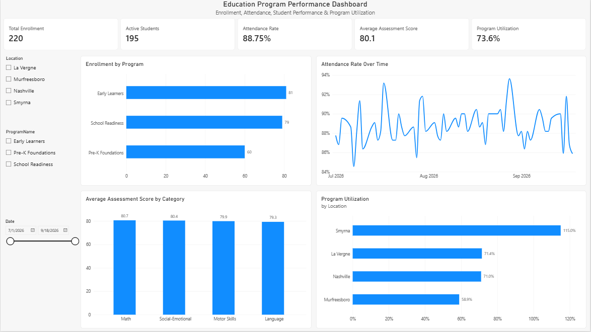

# Education Program Performance Dashboard

An interactive Power BI dashboard designed to analyze student enrollment, attendance, assessment performance, and program capacity across multiple locations.

## Project Overview

The goal of this project was to transform raw education program data into an interactive business intelligence dashboard that helps stakeholders monitor program performance and identify areas that may require attention.

The dashboard provides visibility into:

- Total and active student enrollment
- Attendance rates and trends
- Student assessment performance
- Enrollment by program
- Program capacity and utilization by location
- Interactive filtering by location, program, and date

## Tools & Technologies

- Microsoft Power BI Desktop
- Power Query
- DAX
- Data Modeling
- CSV
- GitHub

## Data Preparation

The project uses four CSV datasets containing student, program, attendance, and assessment information.

Power Query was used to prepare and validate the data before analysis. This included:

- Reviewing and correcting column data types
- Trimming identifier fields to prevent relationship issues
- Checking for duplicate and null values
- Validating student and program identifiers
- Reviewing row counts after transformations to ensure data integrity

## Data Model

A relational data model was created to connect program, student, attendance, and assessment data.

The primary relationships include:

- Programs (1) → Students (*)
- Students (1) → Attendance (*)
- Students (1) → Assessments (*)
- DateTable (1) → Attendance (*)

A dedicated Date table was also created using DAX to support date filtering and time-based attendance analysis.

This structure allows filters applied to programs, locations, students, and dates to dynamically update related dashboard metrics and visualizations.

## DAX Measures

Custom DAX measures were created to calculate key performance indicators, including:

- Total Enrollment
- Active Students
- Attendance Rate
- Average Assessment Score
- Program Utilization

Example:

```DAX
Attendance Rate =
DIVIDE(
    CALCULATE(
        COUNTROWS(powerbi_attendance),
        powerbi_attendance[AttendanceStatus] = "Present"
    ),
    COUNTROWS(powerbi_attendance),
    0
)
```

## Dashboard



The dashboard combines KPI cards, trend analysis, categorical comparisons, and interactive slicers to provide a high-level view of program performance.

Users can filter the dashboard by location, program, and date to explore different segments of the data.

### Key Metrics

- Total Enrollment: 220
- Active Students: 195
- Attendance Rate: 88.75%
- Average Assessment Score: 80.1
- Overall Program Utilization: 70.9%

## Business Insights

Analysis of the dashboard identified several key findings:

- 195 of 220 enrolled students are currently active.
- Overall attendance is approximately 88.75%, with daily attendance fluctuating over the reporting period.
- Assessment performance is relatively consistent across categories, with Math having the highest average score at 80.7 and Language the lowest at 79.3.
- Early Learners has the highest enrollment with 81 students, followed by School Readiness with 79 and Pre-K Foundations with 60.
- Smyrna shows 115% program utilization, indicating that active enrollment exceeds the capacity represented in the dataset.

The Smyrna utilization result would require further validation in a real business environment. The next step would be to verify the underlying enrollment and capacity data before determining whether the result represents a capacity issue or a data quality issue.

